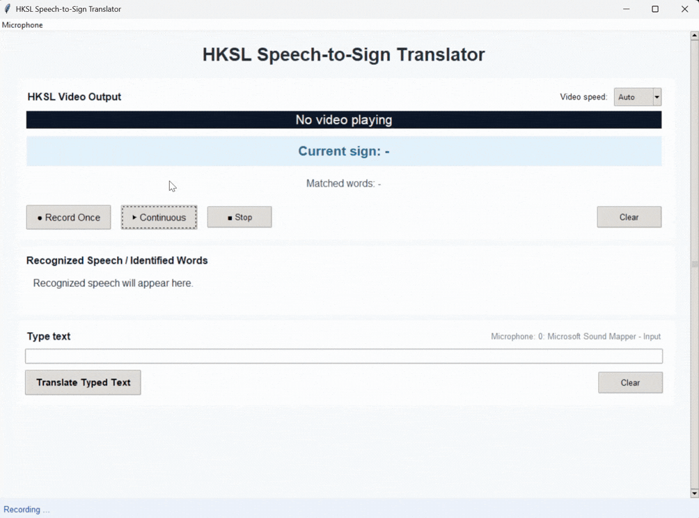

# HKSL_Translator
Speech-to-HKSL translator using Whisper and video-based sign output for inclusive education

## What problem does this solve?

In many classrooms, deaf or hard-of-hearing students rely on lip-reading or interpreters. However:
- lip-reading is difficult in various setting (i.e., teacher is facing the blackboard)
- interpreters are not always available

This tool helps bridge that gap by converting speech into sign language automatically.

## How it works

1. User speaks or types English
2. Speech is converted to text (using Whisper)
3. Text is matched with HKSL signs
4. Corresponding sign videos are displayed

## Features

- Speech-to-text using Whisper
- Real-time recording, one-time recording, typing modes
- HKSL video playback
- Adaptive video speed based on speech
- Highlighting of current word being signed
- Simple and accessible interface

## How to run

1. Install dependencies: `pip install -r requirements.txt`
2. Run the app: `python app.py`

## Important

- Keep the `data/` folder in the same directory as the app.
- Make sure microphone access is enabled.
- If Windows asks for microphone permission, click **Allow**.

If recording does not work:

1. Press **Windows + I**.
2. Go to **Privacy & Security → Microphone**.
3. Turn on:
   - **Microphone access**
   - **Let desktop apps access your microphone**
4. Restart the app.

## For non-technical users

You can also use the packaged `.exe` version:
1. Download the folder
2. Open `HKSL_Translator.exe`
3. Select microphone
4. Click "Record Once" or "Continuous"

## Demo

## Technologies used

- Python
- OpenCV
- Whisper (speech recognition)
- Tkinter (GUI)
